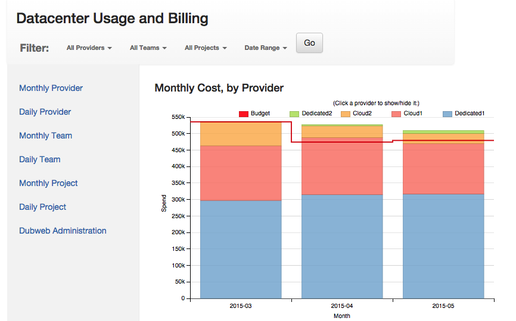

# Measuring Costs

### Service Costs

TANSTAAFL - "There Ain't No Such Thing As A Free Lunch" has never been more true.  Although cloud providers may periodically lower prices (as they gain efficiency), the major portions of their bills (power for the compute and cooling) don't decrease. At the same time customers demand a better, more personalized experience. Providing a personalized experience for customers requires bigger datasets, more processing, and specialized computing systems to deliver results with less latency.

### Many Providers

In the span of about two years, a certain software department went from a dedicated hosting company and a small footprint in AWS to:

- Dedicated and cloud offerings from a different hosting company
- Multiple footprints in AWS
- Multiple footprints in Google

### DUBWeb

The DUBWeb tool is a web-based (Python Flask) application, with a MySQL database backend.  Rendering is fairly smooth and swift, with dimple.js (d3-wrapper) providing the charts:

It also features an ETL python script to collect the billing data from the provider's CSV or JSON (when an API is available), or from a local CSV.  Since the tool's creation, I've added:

- budget forecasting (based on current and last months totals, extrapolated)
- capacity modeling (based on performance in the lsat week)
- administration (basic auth on Create/Update)
- workload analysis, available on the project level for certain cloud providers who surface this type of data

### Efficiency and Cost

Tracking cost has added benefits.  I've found multiple issues where cloud providers overcharged, due to bugs, etc.  Understanding the resources you are using every month (or day, depending on how you collect billing data) helps drive efficiency.

Best of all, the tool is free ;-)  and available [here](https://github.com/zulily/dubweb). Enjoy!
